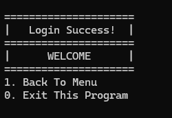

# Interactive CLI Auth Flow 

This project demonstrates how to create an Auth flow in interactive CLI using Go language

## Preview

#### Menu


#### Register


#### Login


#### Home


## How to Run This Project

1. Clone the repository:
   ```bash
   git clone https://github.com/VsalCode/fgo24-go-auth-flow.git
   ```

2. Navigate to the project folder:
   ```bash
   cd fgo24-go-auth-flow
   ```

3. run the program:
   ```bash
   go run main.go
   ```


## How to Contribute
Pull requests are welcome! For major changes, please open an issue first to discuss your proposed changes. Ensure tests are updated as needed.

## License
[MIT](https://opensource.org/license/mit)
